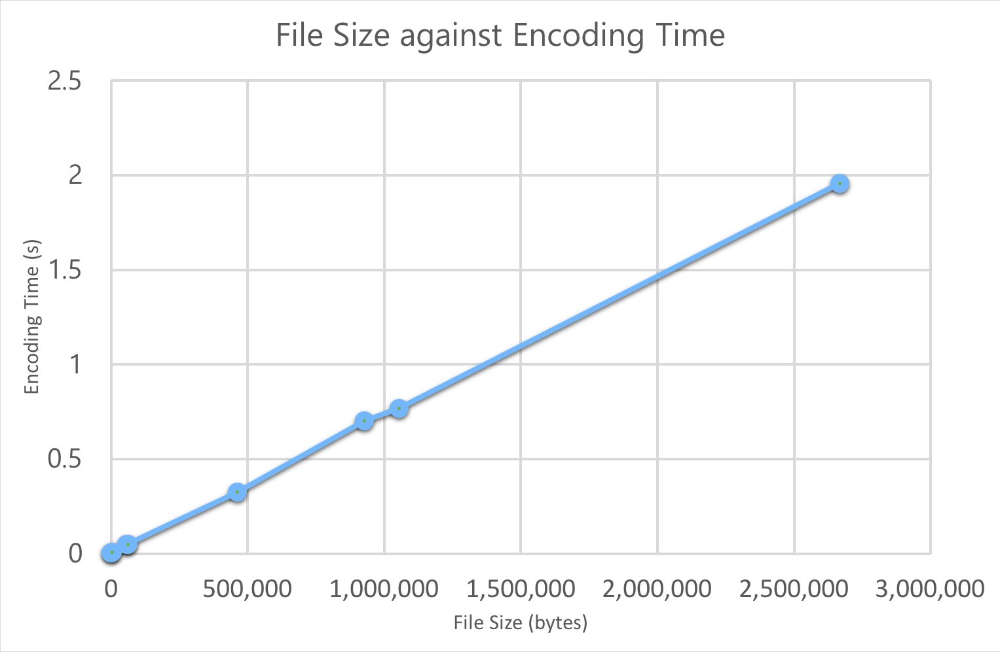

# Huffman Coding Assignment
###### vzbf32 | Z0973057 | Feb 2018

# Introduction
Huffman coding relies on assigning code words to characters, with the length of the code word being roughly proportional to the frequency of the character in the encoding text. Each character is then replaced with a code word, and then the code word dictionary and the encoded text is written to a new file, which will have a smaller file size (on average).

I opted to implement canonical Huffman coding as it has a far smaller dictionary (and thus smaller encoded file size), although this does increase the CPU workload as the code words have to be reconstructed rather than simply read from the file.

# How to Execute the Program
This program is designed to be run on Python 3.6.3.
## Encoder
To encode a file `some_text.txt`, navigate to the directory containing `huffman.py` and run:

```bash
$ python3 huffman.py -e some_text.txt
```

This will encode `some_text.txt` and write the output to `some_text.hc`.

## Decoder
To decode a file `some_text.hc`, navigate to the directory containing `huffman.py` and run:

```bash
$ python3 huffman.py -d some_text.hc
```

This will decode `some_text.hc` and write the output to `some_text_decoded.txt`.

# Implementation
## Encoder
The program starts by reading a plain text file as a sequence of bytes. It counts the frequency of each byte and stores this in a list with 256 elements. We can do this instead of using a dictionary because there are only 256 possible bytes (ranging from `00000000` to `11111111`), and so we set the value of the `i`th element in the frequency list to be the frequency of the byte `i`.

### Example
For example, the ASCII text file

```
Hello
```

is represented, in bits, as

```
01001000 01100101 01101100 01101100 01101111
```

If we represent our bytes using decimal values, we have

```
72 101 108 108 111
```

This gives us the frequencies:

| byte      	| ... 	| 72 	| ... 	| 101 	| ... 	| 108 	| ... 	| 111 	| ... 	|
|-----------	|-----	|----	|-----	|-----	|-----	|-----	|-----	|-----	|-----	|
| **frequency** | 0   	| 1  	| 0   	| 1   	| 0   	| 2   	| 0   	| 1   	| 0   	|

And thus elements nos. `72`, `101` and `111` have value `1`, element no. `108` has value `2`, and the rest have value `0`. Note that we start counting from index `0`.

### Canonical Huffman Algorithm

Now that we have our bytes and their frequencies in a dictionary, we build a heap using `heapq` (and a wrapper class `Heap`, which merely makes using `heapq.heappop()` and `heapq.heappush()` more readable). We use a heap because it has the characteristic that the top element always has the smallest value, so this saves us having to sort a list every time.

In our case, each element on the heap has a _frequency_ and a _tree_ associated with it. The _frequency_ is the sum of the frequencies of the bytes in that element's tree, and the _tree_ is the tree of bytes that we have merged so far in that heap element.

We iterate through the heap, popping the top two items (a heap is always ordered such that the top item is the smallest), summing their frequencies and creating a branch with the smallest element's tree on the left, the second smallest element's tree on the right, then pushing this new heap element back onto the heap. We do this until we have a single heap element left – its frequency is the sum of all frequencies (i.e. the number of bytes in the text file) and its tree is the byte tree, which we shall traverse.

We recursively traverse the tree and label each leaf we find using an `OrderedDict` (as this is both fast and ordered). As we traverse the tree, we append a `0` to the current code word if we go left down a branch, and a `1` if we go right. This means that every leaf is given a code word such that, if we find part of a code word in our encoded text, there is no ambiguity about which byte that code word is associated with. This is a feature of Huffman coding.

We then generate new code words, as per the [canonical Huffman algorithm](https://en.wikipedia.org/wiki/Canonical_Huffman_code). _First_, we sort the code words by code word length, and _secondly_ by alphabetical value. We then adhere to the following algorithm:

1) The _first_ byte in the dictionary is assigned a code word which is the same length as the byte's original code word, but all zeros.
2) Each subsequent byte is assigned the next binary number in sequence, ensuring that successive code words are always higher in value than the preceding ones.
3) When we reach a longer code word, we left-shift the new code word (i.e. append zeros) until its length is equal to that of the old code word.

> Initially, I generated the new code words by using strings and appending `"0"` or `"1"` to the code word, as required. Unfortunately, string concatenation is slow (because strings in Python are immutable) and so I switched to using a number (an `int`) to describe the code word. However, I found that this meant I lost leading zeros, so the code word `000110` would be stored as `110` in memory (decimal value `6`). To get round this issue, I prepended all my code words with a `1` while doing arithmetic (addition, left-shifting) and then stripped away the `1` when finally storing the code word as a string in my code words dictionary.

Once we have a dictionary of bytes and code words, we iterate through the text file's contents and replace each byte with the code word associated with that byte. While some bytes (note that each byte is 8 bits long) were replaced with code words longer than 8 bits, the majority were replaced with code words fewer than 8 bits long, making the encoded text use fewer bits on average.

> While I originally used string concatenation as follows,
> ```python
> encoded_file_contents = ""
> for byte in file_contents:
>     encoded_file_contents += codewords[byte]
> ```
> I realised that this was the bottleneck in my program as I had to recreate the `encoded_file_contents` string for every iteration of the loop. This was particularly costly for large text files where the number of string concatenations could be in the order of the millions or greater.
>
> Instead, I switched to using list comprehension and the `"".join()` method in Python:
> ```python
> encoded_file_contents = "".join([codewords[byte] for byte in file_contents])
> ```
> In my testing, I found this to be around 7–10x faster (even more in some instances), and this vastly decreased my encoding time.

### Output File Structure
Once our file contents are encoded, it is a simple matter of deciding on a dictionary structure (to store with the output file) and writing everything to an output file.

A neat characteristic of the canonical Huffman coding algorithm is that we only need to store the _lengths_ of the code words (and the set of bytes we encoded) rather than the code words themselves. This vastly decreases the output file size as we can store each length in a single byte (no code word will ever be longer than `256` bits long) as opposed to having to store both the code word and the length of the code word in the file dictionary. This method is also far easier to write a decoder for, as we can simply read the file byte-by-byte and reconstruct the dictionary without too much difficulty.

We need to also store the number of unique bytes that appeared in the original text (let us call this `N`), so that we know how long our dictionary is when we read the file for decoding.

Note additionally that, due to constraints imposed by the operating system, we must write a multiple of 8 bits to disk (i.e. a whole number of bytes). Because we cannot guarantee that our encoded file contents will be a multiple of 8 bits long, we need to append some padding zeros to the end of the file and therefore we also need to store the number of padding zeros in the file.

Thus, our encoded file structure is as follows:

1) Number of padding bits (`1` byte long)
2) `N` (`1` byte long)
3) List of lengths of each code word (`N` bytes long)
4) List of occurring bytes (`N` bytes long)
5) Encoded file contents (varying length, not necessarily a whole number of bytes)
6) Padding zeros (between `0` and `7` bits long)

### Special Cases
#### Empty File
If we are encoding an empty file, our code words dictionary will be empty and our byte frequency list will be equivalent to `[0] * 256`. All we write to file is the number of padding zeros (calculated to be `0`), the number of unique bytes `N = 0`, and the padding bits themselves (of which there are none), leaving us with the file:

```
00000000 00000000
````

#### Single-Byte File
If we are encoding a file of just a single byte, we manually define the code word associated with that byte to be `0` to save creating the heap and traversing the tree. We then write to file the number of padding zeros (`7`, since our encoded file contents will only be one bit long), the number of unique bytes (`1`, the byte itself), the length of the code word `0` (i.e. the number `1`), the single occurring byte (let us use ASCII `a` in this example), the encoded file contents `0` and the seven padding bits. This gives us the file:

```
00000111 00000001 00000001 01100001 00000000
```

#### Remarks
Although the output file is larger than the input file in both special cases, the output file is in keeping with the canonical Huffman coding structure we defined, and so it makes sense for the program to handle these edge cases in this way.

## Decoder
The decoder effectively does the encoding process in reverse.

### Parsing the Encoded File
We start by reading a file in as a sequence of bytes and pulling out the values for the number of padding bytes and the number of unique bytes `N`. We then read the next `N` bytes and store them in an ordered dictionary (these are the lengths of our code words), then read the next `N` bytes after that (the list of bytes that correspond to each code word length) and add those to our dictionary.

Now that we know our bytes and our code word lengths, we can reconstruct our code words by following the same algorithm as above. Observe how we do not actually need to know the original code word, just its length and the byte to which it corresponds in order.

> Again, we use the 'leading `1`' trick to allow us to store the code word as an `int` and to keep track of leading zeros. We then discard the leading `1` once we eventually convert the final code word to a string for storing in our reverse code words dictionary.

We need to use a reverse code words dictionary instead of just a normal dictionary – by which we mean that the code word itself is the key and the byte it is associated with is the value, as opposed to the other way around. This is a requirement as we will be reading code words in from the encoded file and we need to look up which byte associates with which code word.

### Double-Counter Search
The decoding algorithm uses what we shall call a _double-counter search_. We have two counters `i` and `j`, where `i` is at the start of each codeword and `j` iterates through every bit after `i`. If the bit string between `i` and `j` is in the code word dictionary's keys, then we know the given bit string is a code word. We look up the byte associated with this and add this to our output bytes, move the counter `i` to `j-1` (i.e. to the start of the next code word) and then set `j` to `i+1`, so that `j` is now one bit ahead of `i`.

We can illustrate this with the simple dictionary `{ 0 : a, 10 : b, 11 : c }` and the encoded string `01011` as follows.

```
1) |0|1011
   i j
   0 => a
   decoded = a

2) 0|1|011
    i j
   1 => no match
   decoded = a

3) 0|10|11
    i  j
   10 => b
   decoded = ab

4) 010|1|1
      i j
   1 => no match
   decoded = ab

5) 010|11|
      i  j
   11 => c
   decoded = abc
```

The double-counter search is a fast and efficient way of iterating through the encoded text and rebuilding the original cleartext.

### Special Cases
#### Empty File
If we read that there were `0` unique bytes in the original file (i.e. that `N = 0`), then we know the original file was completely empty and so we just write an empty file to disc.

#### Single-Byte File
If we read that `N = 1`, then we manually define the code word `0` to match to the single byte `<byte>` defined in the file. We then read the rest of the file and decode it as normal, using our dictionary `{ 0 : <byte> }`.

# Analysis of Results
The encoder was run for several text files of varying sizes. The size of the encoded file and the average compression time were recorded, and the compression ratio (calculated as `encoded size / original size`) was computed for each file as well. with the values tabulated below.

| File Size (bytes) 	| Encoded Size (bytes) 	| Compression Ratio (%) 	| Compression Time (s) 	|
|-------------------	|-------------------------	|-----------------------	|----------------------	|
| 716 	                | 451 	                    | 63.0                  	| 0.00423 	            |
| 5,150 	            | 2,904 	                | 55.3 	                    | 0.00739           	|
| 57,024 	            | 35,132 	                | 61.6 	                    | 0.04820           	|
| 61,824 	            | 33,235 	                | 53.8 	                    | 0.05038           	|
| 462,070 	            | 264,179 	                | 57.2 	                    | 0.32449           	|
| 927,207 	            | 518,531 	                | 55.9 	                    | 0.70047           	|
| 1,055,021             | 614,807 	                | 58.3 	                    | 0.76849 	            |
| 2,668,114             | 1,560,590                 | 58.5                  	| 1.95776           	|

We can see how the encoding is fast, taking under two seconds to encode the monumental _Great Expectations_ (Charles Dickens) text file.

While the compression ratio varies for smaller files, for larger files it appears to sit consistently between 55–60%.



We see how there is an almost linear relationship between file size and encoding time. This means that a file that is twice as large will, on average, take twice as long to encode.

However, this is not always true. I created a file `lorem_ipsum.txt` of file size `3562` bytes and ran it three times through the encoder; this took an average time of `0.00756` seconds. I then duplicated the contents of this file `4096` times to create a file of size `14,589,952` bytes, and encoding this took an average of `14.588` seconds. If we were to base the encode time of the large file on the small one, we would expect it to take `0.00756 × 4096 = 30.97 seconds`. In reality, of course, we see how it is much quicker – and the reason for this is that the text itself is repeated many times so we do not use any more code words than in the smaller file, and thus the dictionary lookup is quicker when we encode each byte, in comparison to a larger file with non-repeating text blocks.

We can reasonably assume a direct proportionality between the file size and the encode time, taking the reasoning that a larger text file is likely to use a larger set of bytes, and thus the code words dictionary will be larger (thereby increasing code word lookup time for bytes).

# Limitations and Possible Extra Features
### Dictionary
There are two distinct methods that can be used to store a canonical Huffman code dictionary in a file. In our case, we stored the lengths of the code words, the bytes that were used and the number of bytes that were used (`N`). This means the size of our dictionary is `2N+1`.

However, if `N > 128` (i.e. the file uses a wide range of different characters), then it would be more space efficient to store a fixed dictionary of length `256` bytes, where the length of the code word for every single possible byte (i.e. bytes in the range `00000000` to `11111111`) is stored, with non-occurring bytes having code word length `0`. This would also save having to store `N` in the file as we would consider it to be 256. Of course, this would be very space inefficient for small text files – if we have a file that only uses `4` unique bytes, then we'd be storing a dictionary of size `256` instead of one of size `2 × 4 + 1 = 9`!

This would probably be more prevalent in text files with lots of non-ASCII characters. _War and Peace_ only uses `90` unique bytes, but a file with lots of non-English characters could well use more than this due to the way UTF-8 encoding works.

### Faster Code Word Construction
If we observe carefully, we see that we do not actually need to know the original code words before we construct the canonical code words. In fact, we only need to know their lengths, so we could probably optimise our program a little by only counting the depth of each leaf node rather than assigning a code word to it when we traverse the tree.

We could then compare the canonically generated code word's length against the depth of that leaf (which would be equivalent to the length of the code word stored with that leaf) rather than calculating the length of the original code word associated with that leaf.

### Padding Zeros
We store anywhere between `0` and `7` padding zeros. The number `7` can be described in binary as `111`, which is just `3` bits long. However, we use a whole byte (`8` bits) to describe the length of the padding zeros.

If we were a little smarter about it, we could just store `3` bits to describe the number of padding bits and plan around this appropriately, but we would probably have to adjust the number of padding bits to reflect this. However, if space is a real concern, this could save one byte in some cases.

### Max Code Word Length
While not really a limitation, it is worth noting that the maximum length of a code word that can be stored is `256` (the maximum value that can be held by a single byte). However, it turns out that the longest a code word can ever be is `256` bits (if that leaf is at maximal depth `256` in the tree), so this is not a concern.
